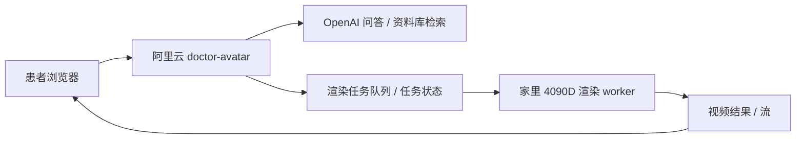

# 视频分身二期方案

这份文档只讨论“在当前 `doctor-avatar` 项目上，如何把文字/语音医生助手升级成更像真人的视频分身”。

当前约束：

- 云端主站：阿里云 ECS，`2核2G`
- 主站职责：网页、API、资料库、自动部署
- 家里有一台 `4090D`
- 目标不是便宜卡通数字人，而是尽量接近“李勇医生本人”的可信视频交互

## 结论

不建议把 `Live2D` 作为主路线。

推荐优先级：

1. `Ditto`
2. `MuseTalk 1.5`
3. `EchoMimicV2`
4. `LatentSync 1.6` 只作为高精度口型同步补充，不作为当前主线

建议架构：

- 阿里云继续保留现有网页、问答、资料库、控制台
- 家里 `4090D` 单独跑“视频渲染 worker”
- 前端先保持“文字/语音立即响应”
- 视频分身作为第二阶段无缝接入，不要求第一天就做成全实时流式

## 为什么不把 Live2D 当主路线

`Live2D` 的优势是：

- 成本低
- 前端即可运行，几乎不吃云端 GPU
- 很适合二次元/客服助手/品牌 IP

但它不适合这个项目的主目标：

- 用户要的是“像你爸本人”
- 医疗场景更依赖可信度，而不是可爱或轻量动画感
- 老年患者更容易接受“真人照片/真人视频驱动”，而不是 2D 形象

如果后面要做低成本备用方案，可以保留 `Live2D` 作为“降级模式”或“未接通真人渲染时的占位模式”，但不建议把它当主方案。

参考：

- [Live2D Cubism SDK for Web](https://www.live2d.com/en/sdk/download/web/)

## 模型路线判断

### 1. Ditto

当前最值得优先试。

理由：

- 官方定位就是实时 talking-head
- 比单纯嘴动更自然，头部微动更适合“医生在和你说话”的感觉
- 更适合“实时 AI 助手 / 视频分身”场景

参考：

- [Ditto 官方仓库](https://github.com/antgroup/ditto-talkinghead)

### 2. MuseTalk 1.5

这是最稳的备选。

理由：

- 成熟度高
- 社区案例更多
- 官方明确强调 `30fps+`
- 如果 Ditto 的工程复杂度偏高，MuseTalk 1.5 更适合作为可快速落地的第一版真人视频方案

参考：

- [MuseTalk 官方仓库](https://github.com/TMElyralab/MuseTalk)

### 3. EchoMimicV2

适合第二阶段强化“上半身动作”和真实感。

理由：

- 表达比单纯口型更丰富
- 对“坐在镜头前的医生”这种半身交互有吸引力
- 但第一版不一定需要这么重的动作表达

参考：

- [EchoMimicV2 官方仓库](https://github.com/antgroup/echomimic_v2)

### 4. LatentSync 1.6

不建议作为现在的主路线。

理由：

- 口型质量高
- 但更像高精度 lip-sync 组件
- 当前项目优先级是“产品可集成、实时性、整体可信交互”，不是单点追求嘴型最准

参考：

- [LatentSync 官方仓库](https://github.com/bytedance/LatentSync)

## 推荐架构

### 阿里云保留的职责

- 用户端页面
- 控制台
- 问答 API
- 资料库和知识检索
- 渲染任务编排
- 渲染任务状态查询

### 家里 4090D 增加的职责

- 加载真人视频驱动模型
- 根据文本、音频、情绪标签生成视频
- 向主站返回渲染结果或流地址

### 为什么这套适合现在的机器

因为你阿里云只有 `2核2G`，所以：

- 不应该让阿里云承担视频生成
- 也尽量不要让阿里云做重转码
- 阿里云最适合做轻量调度和网页服务

## 不建议第一天就做“纯实时流式视频”

更推荐分三阶段：

### 阶段 1：音频先行，视频后到

流程：

1. 用户提问
2. 阿里云生成回答文本
3. 立刻开始 TTS 回答
4. 同时把文本/音频发给家里 `4090D`
5. 前端几百毫秒到几秒后切换到说话视频

优点：

- 首字延迟更低
- 产品体验更稳
- 研发复杂度更低

### 阶段 2：短片段准实时

不是整句答完再出视频，而是：

- 按句子或短片段生成
- 前端连续播放

这样更接近实时视频通话，但仍然比全流式更稳。

### 阶段 3：真正流式 talking-head

等前两阶段稳定后，再考虑：

- WebRTC
- 真流式渲染
- 更复杂的音视频同步

## 网络与安全建议

不建议把家里 `4090D` 渲染服务直接裸暴露公网。

优先顺序：

1. `Tailscale / WireGuard`
2. `frp`
3. 公开端口直连

原因：

- 你的视频 worker 比主站更敏感
- 直接暴露公网会增加被扫和误调用风险
- 当前阶段更适合受控的内网/隧道方式

如果后面真的走 WebRTC，再补：

- `STUN`
- 必要时 `TURN`

参考：

- [WebRTC TURN 说明](https://webrtc.org/getting-started/turn-server)
- [Tailscale 服务暴露说明](https://tailscale.com/docs/features/serve)

## 在当前项目里的落地方式

### 建议新增的 API

- `POST /api/avatar/jobs`
  - 提交一条视频生成任务
- `GET /api/avatar/jobs/{job_id}`
  - 查询任务状态
- `GET /api/avatar/jobs/{job_id}/result`
  - 获取视频 URL 或播放信息

### 建议新增的数据结构

在现有 SQLite 里新增轻量任务表即可，不需要新数据库：

- `avatar_jobs`
  - `id`
  - `status`
  - `input_text`
  - `tts_audio_url`
  - `emotion`
  - `renderer`
  - `result_url`
  - `created_at`
  - `updated_at`

### 前端建议

保持当前用户端结构不推倒重来：

- 左侧主舞台继续保留
- 右侧提问舱继续保留
- 当前静态舞台作为“等待态”
- 有视频结果时，主舞台直接切换成视频播放器

也就是说，当前网页已经是合适的视频承载壳，不需要为视频分身重做一套新站。

## 现在最推荐的执行顺序

1. 先选一个主模型：
   - 优先 `Ditto`
   - 备选 `MuseTalk 1.5`
2. 在家里 `4090D` 上先跑通单张李勇医生正脸图
3. 先做“生成一个回答视频文件”
4. 再把它接到 `doctor-avatar` 的主舞台
5. 稳定后再推进到分段准实时

## 当前项目建议

对 `doctor-avatar` 来说，下一阶段最值得做的不是立刻把模型装到线上，而是先补一份二期工程骨架：

- 渲染任务数据结构
- 家里 worker 的 API 协议
- 前端主舞台的视频接入位
- 控制台里的渲染任务调试区

等这些骨架稳定后，再决定第一套真人视频模型到底用 `Ditto` 还是 `MuseTalk 1.5`。

## 当前推荐

一句话版：

- 不把 `Live2D` 当主路线
- 保留它作为便宜降级方案可以
- 主路线优先 `Ditto`
- 快速落地备选 `MuseTalk 1.5`
- 阿里云只做网站和调度
- 家里 `4090D` 做渲染 worker
- 先做“音频先响应，视频后补上”的产品路线
